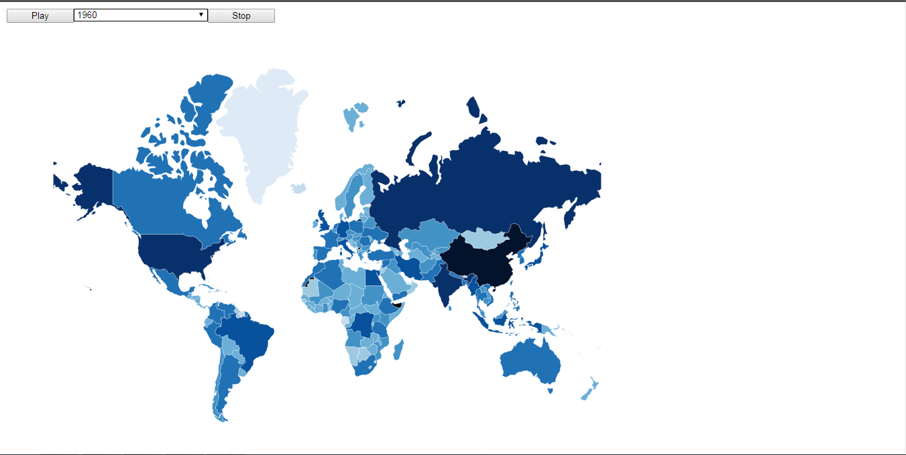

# Task 3: Challenge Exercise

The goal of this challenge is the following:

    Based on the population country and year we got on the first nvd3 sample (1960 - 2016 all countries in the world), create a world map chart and combo to pick the year and display data as a plus create an animated version, transitioning from 1960 to 2016.

To do this exercise we start from the code of the following page: 

    https://github.com/Lemoncode/d3js-samples/tree/master/samples/04%20maps/01%20world_interaction

First, I'm going to explain how to run the code and the different options that we can select in it. 

To explain how to run the code I'm just going to copy the intructions given in the previous link.

These first steps are needed because of we are going to make ajax requests and we will need to set up a little web server in order to avoid that Chrome blocks the requests. 

- Run the following lines from a Windows console and make sure that you are in the folder where the files are saved.

- Let's first execute _npm init_ (you will need nodejs installed).

```bash
npm init
```

- After filling the data requested in init (remember project name must be lowercase, contain no spaces, and do not collide with well known
library names), we are going to install _lite-server_.

```
npm install lite-server --save-dev
```

- Now let's update our _package.json_ and add a _start_ command.

_package.json_

```diff
"scripts": {
+  "start": "lite-server",
   "test": "echo \"Error: no test specified\" && exit 1"
},
```
- Let's start the sample

```bash
npm start
```
Once we've done this steps the next time we just need to write the need to run the npm start command.



At the top of the screen we can see a Play button, a selecton box and a Stop button. 

With the selection box we can select the year in which we want to see the population. Once we've selected the year, if we put the mouse on a country, we'll see the name of this country and the population in the selected year.

If we click on the Play button we can see how the population change through the years. We can observe how the colors of the different countries is changing when the population increase or decrease. The process starts in the year we have selected at the selection box.

If we click on the Stop button, the process will be stopped and we just have to click on the play button if we want to start in the same point where we've stopped the process.

Now, let's see some important parts of the code.

The selection box is added with the D3 library as follow:

```
var select = d3.select('body')
  .append('select')
    .attr('class','select')
    .attr("id", "myselect") 
    .on('change',onchange)

var options = select
  .selectAll('option')
	.data(years).enter()
	.append('option')
    .text(function (d) { return d; });
```
The years data, is loaded in the following lines:

```
var years = []

countryData.forEach(function (d) { years.push(d.Year) });

years = [...new Set(years)];
```

Making a Set with the years array we delete the duplicate information. The '...' comand make that the Set will be spread in the array. 

The onchange function make the map changes as follow:

```
function onchange() {
  queue()
  .defer(d3.json, "world_countries.json")
  .defer(d3.tsv, "world_population.tsv")
  .await(ready);

  var sel = document.getElementById('myselect');
  year = sel.options[sel.selectedIndex].value
  year_population = countryData.filter(checkYear)

};
```
What we made in this function is load the countries json, the population json, check the year selected and filter the population in the countryData variable in order to get the information of the selected year. 

```
function checkYear(d) {
  return d.Year == year;
}
```

Let's see the function ready

```
function ready(error, data, population) {
  var populationById = {};
  for(i=0; i < year_population.length; i++) {
     for(j=0; j < population.length; j++) {
       if(year_population[i]['Country Name'] == population[j].name){
         population[j].population = year_population[i].Value
       }
     }
  }
  population.forEach(function (d) { populationById[d.id] = +d.population; });
  data.features.forEach(function (d) { d.population = populationById[d.id] });

  svg.append("g")
    .attr("class", "countries")
    .selectAll("path")
    .data(data.features)
    .enter().append("path")
    .attr("d", path)
    .style("fill", function (d) { return color(populationById[d.id]); })
    .style('stroke', 'white')
    .style('stroke-width', 1.5)
    // tooltips
    .style("stroke", "white")
    .style('stroke-width', 0.3)
    .on('mouseover', function (d) {
      tip.show(d);

      d3.select(this)
        .style("stroke", "white")
        .style("stroke-width", 3);
    })
    .on('mouseout', function (d) {
      tip.hide(d);

      d3.select(this)
        .style("stroke", "white")
        .style("stroke-width", 0.3);
    });
}
```

In the for loop at the beggining is changed the population data in the world_population.tsv file by the selected year population. Then we put this information into the data(world_countries.json) variable and finally this data is processed in order to change the map.

Now, let's see how the play bottom works:

```
var button = d3.select('body')
  .append('input')
    .attr('id', 'playButton')
    .attr('Value', 'Play')
    .attr('type','button')
    .attr('onclick', 'contador = document.getElementById("myselect").selectedIndex ; play()')

function play() {
    window.setTimeout(function () {
      if (contador == -1){
        return ;
      }
        queue()
          .defer(d3.json, "world_countries.json")
          .defer(d3.tsv, "world_population.tsv")
          .await(ready);
    
        year = years[contador];
        document.getElementById('myselect').getElementsByTagName('option')[contador].selected = 'selected' ;
        year_population = countryData.filter(checkYear);
        contador++;
        if (contador < years.length){
          play();
        }
    }, 500);
}
```

First, we put the button into the page. We define the onclick attribute in order to check the year selected in the selection box and call to the play function.

In the play function we call to the setTimeout function in order to make possible to see the changes on the map through the years, if we don't delay the loop the process is so fast that we can observe the changes.

Inside the if statement we are changing the year (by going across the array years) and we are doing what we did in the onchange function. We also change the selected option in the selection box in order to know the year we are in every moment.

Let's see now how the stop button works:

```
var button = d3.select('body')
  .append('input')
    .attr('id', 'stopButton')
    .attr('Value', 'Stop')
    .attr('type','button')
    .attr('onclick', 'stop()')

function stop() {
  contador = -1;
  play();
}
```
In the stop function we change the contador value and call to the play function in order to do that the code doesn't enter in the if statement and, in that way, we stop the process.

